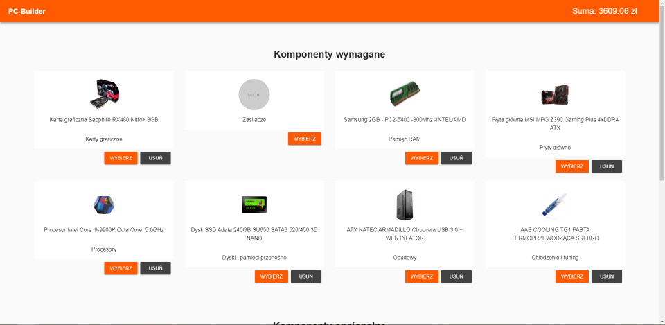
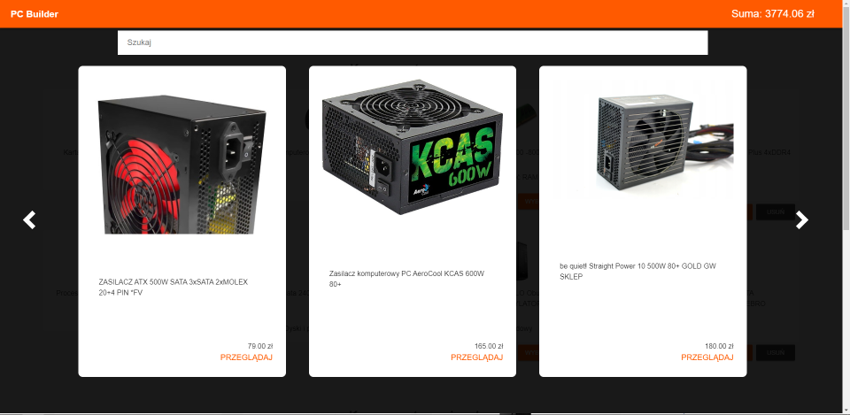
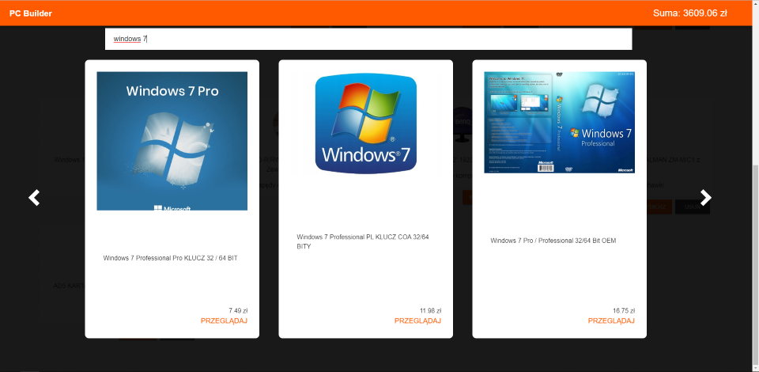

# PCBuilder
Projekt PCBuilder do klikalnej konfiguracji komputera PC tworzony na hackatonie Allegro Braincode 2019.
### Skład :
- [Artur Białoskórski](https://github.com/ABialoskorski)
- [Konrad Linkowski](https://github.com/KonradLinkowski)
- [Konrad Baranek](https://github.com/KonradBaranek)
## Screenshots
Layout

Wybieranie elementów

Wyszukiwanie elementów

